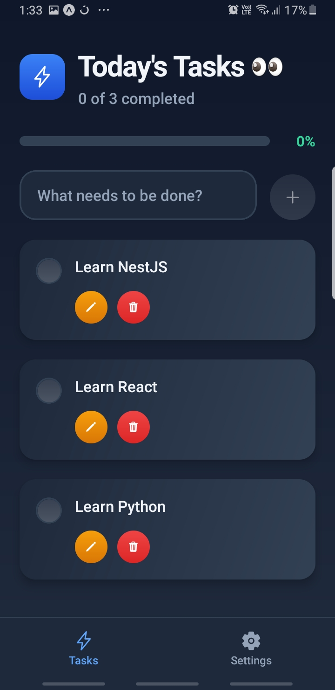
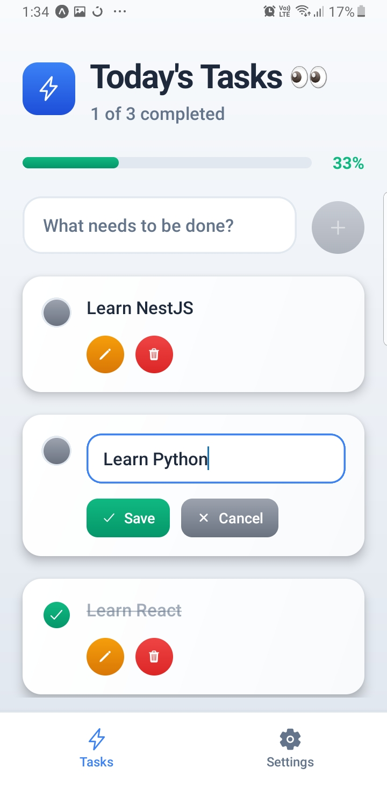
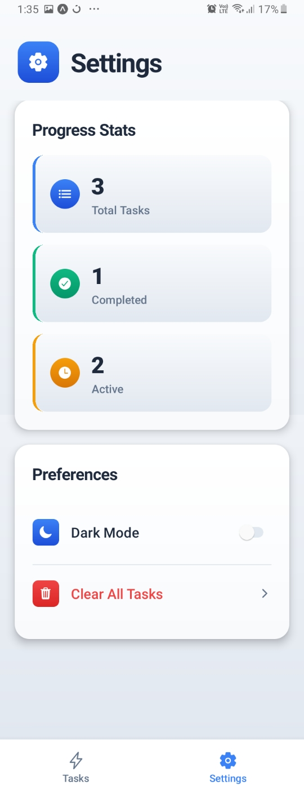

# Task Manager App

A modern, feature-rich task management application built with React Native and Expo. This app provides an intuitive interface for managing daily tasks with a beautiful gradient-based design and theme support.


## Features

- **Add Tasks** - Create new tasks with descriptions
- **Mark Complete/Incomplete** - Toggle task completion status
- **Delete Tasks** - Remove tasks with confirmation dialog
- **Edit Tasks** - Modify existing task descriptions inline
- **Progress Tracking** - Visual progress bar showing completion percentage
- **Smart Sorting** - Incomplete tasks appear first, completed tasks at bottom
- **Theme Support** - Light and Dark mode
- **Empty State** - Friendly UI when no tasks exist
- **Visual Feedback** - Smooth animations and gradient effects

## Screenshots

<div align="center">

<table>
  <tr>
    <td align="center">
      <br/>
      <sub><b>📝 Task Management</b></sub><br/>
      <sub>Add, complete, and track your tasks</sub>
    </td>
    <td align="center">
      <br/>
      <sub><b>✏️ Edit Tasks</b></sub><br/>
      <sub>Modify task descriptions inline</sub>
    </td>
    <td align="center">
      <br/>
      <sub><b>⚙️ Settings</b></sub><br/>
      <sub>Customize your experience</sub>
    </td>
  </tr>
</table>

</div>

## Getting Started

### Prerequisites

Before running this project, ensure you have the following installed:

- **Node.js** (v18 or higher) - [Download](https://nodejs.org/)
- **npm** or **yarn** package manager
- **Expo CLI** - Install globally: `npm install -g expo-cli`
- **Expo Go** app on your mobile device (iOS/Android) - [Download](https://expo.dev/client)

### Installation

1. **Clone the repository**

   ```bash
   git clone <repository-url>
   cd TaskManger
   ```

2. **Install dependencies**

   ```bash
   npm install
   ```

   or

   ```bash
   yarn install
   ```

3. **Start the development server**

   ```bash
   npx expo start
   ```

4. **Run the app**
   - **On Physical Device**: Scan the QR code with Expo Go app
   - **iOS Simulator**: Press `i` in the terminal
   - **Android Emulator**: Press `a` in the terminal
   - **Web Browser**: Press `w` in the terminal

## How to Use

1. **Adding a Task**

   - Type your task description in the input field
   - Press the "+" button or hit Enter/Return
   - Your task appears at the top of the list

2. **Marking Tasks Complete**

   - Tap the checkbox next to any task
   - Completed tasks show a checkmark and move to the bottom
   - Tap again to mark as incomplete

3. **Editing a Task**

   - Tap the pencil icon on any task
   - Modify the text and tap "Save"
   - Or tap "Cancel" to discard changes

4. **Deleting a Task**

   - Tap the trash icon on any task
   - Confirm deletion in the dialog

5. **Viewing Progress**
   - Check the progress bar at the top
   - See completion percentage and task count

## Project Structure

```
TaskManger/
├── app/
│   ├── (tabs)/
│   │   ├── index.tsx          # Main task screen
│   │   ├── settings.tsx       # Settings screen
│   │   └── _layout.tsx        # Tab navigation layout
│   └── _layout.tsx            # Root layout with providers
├── components/
│   ├── Header.tsx             # Header with progress tracking
│   ├── TaskInput.tsx          # Task input component
│   ├── TaskList.tsx           # FlatList wrapper for tasks
│   ├── TaskItem.tsx           # Individual task item
│   ├── EmptyState.tsx         # Empty state UI
│   └── LoadingSpinner.tsx     # Loading indicator
├── hooks/
│   ├── useTasks.tsx           # Task state management (Context API)
│   └── useTheme.tsx           # Theme management hook
├── assets/
│   └── styles/                # Styling files
├── package.json
└── README.md
```

## Technology Stack

### Core Technologies

- **React Native** (0.81.5) - Mobile app framework
- **Expo** (~54.0) - Development platform
- **TypeScript** (5.9.2) - Type safety and better DX
- **React** (19.1.0) - UI library

### Third-Party Libraries

| Library                            | Purpose                                        |
| ---------------------------------- | ---------------------------------------------- |
| **expo-linear-gradient**           | Beautiful gradient backgrounds and UI elements |
| **@expo/vector-icons**             | Icon library (Ionicons) for UI elements        |
| **expo-crypto**                    | Generate unique UUIDs for task identification  |
| **expo-router**                    | File-based navigation system                   |
| **react-native-safe-area-context** | Safe area handling for different devices       |
| **expo-haptics**                   | Haptic feedback for better UX                  |

## Architecture

This app uses a modern React Native architecture:

- **State Management**: Context API with custom hooks (`useTasks`)
- **Component Pattern**: Functional components with hooks
- **Type Safety**: Full TypeScript integration
- **Navigation**: Expo Router (file-based routing)
- **Styling**: Dynamic styles with theme support

### State Management Flow

```
TaskProvider (Context)
    ↓
useTasks Hook
    ↓
Components (Header, TaskInput, TaskList, TaskItem)
```

The `useTasks` hook provides centralized state management for all task operations:

- `addTask()` - Add new task
- `toggleTask()` - Mark complete/incomplete
- `updateTask()` - Edit task description
- `deleteTask()` - Remove task
- `clearAllTasks()` - Clear all tasks

## Features Highlights

### Smart Task Sorting

Tasks are automatically sorted with incomplete tasks at the top and completed tasks at the bottom. When you mark a task as complete, it smoothly moves to the end of the list.

### Progress Tracking

The header displays real-time progress:

- Completion percentage
- Number of completed vs total tasks
- Visual progress bar

### Error Handling

Robust error handling throughout the app:

- Try-catch blocks for all operations
- User-friendly error alerts
- Input validation

### Theme Support

Built-in light and dark mode support with smooth transitions and consistent color schemes.
